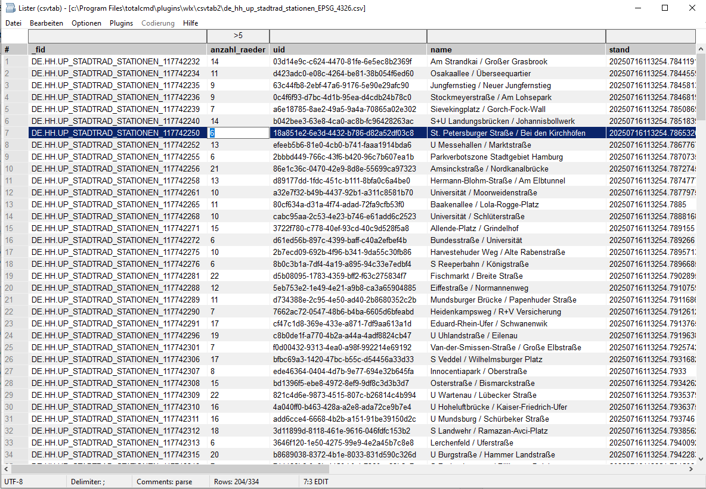
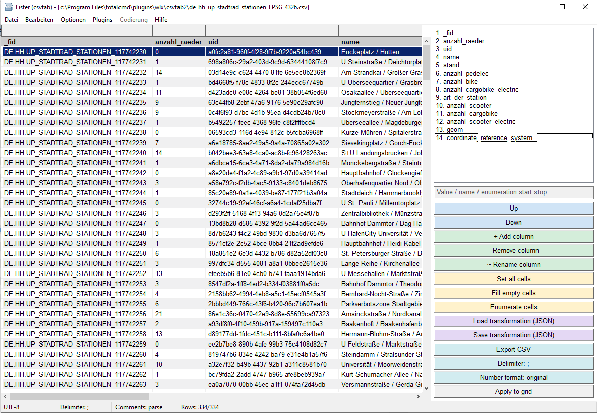

# csvtab (extended)

A [Total Commander](https://www.ghisler.com/) Lister (WLX) plugin to view,
**edit** and **transform** CSV / TSV / TAB files.

This is an extended rewrite of the original
[**csvtab-wlx**](https://github.com/little-brother/csvtab-wlx) by
*little-brother*. It keeps the quick Lister feeling, but turns CSV viewing into
a small workbench: inspect messy files, filter and sort them, edit real cells,
try transformations, and copy or export exactly what you need.

---

## Feature Highlights

### Open messy CSV files with confidence

csvtab is built for the kind of CSV files that are almost, but not quite,
regular.

* Detects ANSI, UTF-8, UTF-16LE and UTF-16BE, including BOM handling.
* Detects common delimiters automatically: comma, semicolon, TAB, pipe and colon.
* Understands quoted CSV, doubled quotes, multiline cells and empty trailing
  cells.
* Skips leading comment/preamble rows in Auto mode, including `#`, `sep=` and
  single-semicolon comment lines.
* Lets you switch encoding, delimiter and comment handling directly from the
  status bar and reloads the table immediately.

### Work in the grid, not around it

* Per-column filters sit above the header and update the table interactively.
* Click headers to sort; the sort indicator shows ascending/descending state.
* Hide noisy columns with Ctrl+click, then restore all columns with
  **Ctrl+Space**.
* Optional line numbers, alternating row colours, dark mode and configurable
  fonts keep large tables readable.
* Decimal alignment lines up `1`, `1.23` and `1,23` in numeric columns, so mixed
  number formats are much easier to scan.
* Total Commander search is supported, including **F3** and **Shift+F3** for
  forward/backward search through the table.

### Edit real CSV data safely

Edit mode turns the viewer into a careful CSV editor without throwing away the
original file structure.

* Toggle **Edit mode** with **Ctrl+E** or **Ctrl+R**.
* Start editing the selected cell with **Enter**, **F2** or double-click.
* Insert a new empty row below the current row from the context menu.
* Delete selected rows with **Ctrl+X** and delete a column from the header menu.
* Save with **Ctrl+S**. The file is written atomically, preserving encoding,
  delimiter, BOM and comment handling as far as possible.
* Dirty files are marked in the status bar and prompt before close or reload.

### Transform columns without touching the original

**Transform mode** opens a sidebar for trying column operations as a live,
read-only preview. The source file is not changed until you explicitly export.

| Area | What it does |
|------|--------------|
| Ordering | Move columns up and down |
| Columns | Add, remove or rename columns |
| Values | Set all cells, fill only empty cells, or enumerate rows |
| Presets | Load and save transformations as JSON |
| Export | Write the transformed result to a new CSV |

The transformation JSON is compatible with the bundled Python workflow, so
repeatable cleanup jobs can be saved and loaded again.

### Copy exactly what you need

* **C** copies the current cell.
* **Shift+C** copies selected rows, respecting hidden columns and column order.
* **Ctrl+C** copies the current column if configured that way.
* The row-copy delimiter is configurable and defaults to TAB.
* **Alt+click** opens URLs found in cells.

### Right-click menu

The grid context menu keeps the everyday actions close to the table:

| Item | Shortcut |
|------|----------|
| Copy cell | C |
| Copy row(s) | Shift+C |
| Copy column | Ctrl+C |
| Insert row below | edit mode only |
| Delete row(s) | Ctrl+X, edit mode only |
| Delete column | edit mode only |
| Hide column | Ctrl+Click header |
| Show all columns | Ctrl+Space |
| Filters | - |
| Header row | - |
| Edit mode | Ctrl+E |
| Transform mode | Ctrl+T |
| Save | Ctrl+S |
| Show line numbers | - |
| Dark theme | - |

---

## Keyboard Shortcuts

| Shortcut | Action |
|----------|--------|
| Enter / F2 / Double-click | Edit the current cell (edit mode) |
| Enter / Esc | Accept / cancel the active cell edit |
| Ctrl+E or Ctrl+R | Toggle edit mode |
| Ctrl+T | Toggle transform mode |
| Ctrl+X | Delete the selected row(s) (edit mode) |
| Ctrl+S | Save the file |
| C | Copy current cell |
| Shift+C | Copy selected row(s) |
| Ctrl+C | Copy current column |
| Ctrl+Space | Show all columns |
| Arrow keys | Move the current cell up/down/left/right |
| Ctrl+Arrow keys | Jump to the first/last row or column |
| Ctrl++ / Ctrl+- | Increase / decrease font size |
| Ctrl+Mouse wheel | Zoom font |
| Alt+Click | Open the URL in a cell |
| Click / Ctrl+Click header | Sort column / hide column |
| F3 / Shift+F3 | Search forward / backward |
| F1 | Open the wiki |

---

## Installation

1. Build the plugin with Free Pascal / Lazarus to produce `csvtab.wlx` and
   `csvtab.wlx64`.
2. In Total Commander open **Configuration -> Options -> Plugins -> Lister
   plugins (WLX) -> Configure -> Add**, then point it at the `.wlx` or `.wlx64`
   file. Total Commander can also install the packaged zip automatically via
   `pluginst.inf`.
3. Open any CSV/TSV/TAB file in Lister with **F3** or in the Quick View Panel
   with **Ctrl+Q**.

---

## Configuration

Settings live in `csvtab.ini` next to the plugin. A few common options:

| Key | Meaning |
|-----|---------|
| `font` / `font-size` / `font-weight` | Grid font |
| `start-mode` | Start in `default`, `editor` or `transformer` mode |
| `header-row` | Treat the first row as a header (0/1) |
| `filter-row` | Show the per-column filter row (0/1) |
| `show-line-numbers` | Show the row-number column on the left (0/1) |
| `decimal-align` | Align mixed integers/floats at the decimal position (0/1, default 1) |
| `dark-theme` | Use the dark colour set (0/1) |
| `skip-comments` | Comment handling: 0 parse / 1 keep / 2 hide / 3 auto-hide leading comment and blank rows |
| `default-column-delimiter` | Force a delimiter (empty = auto-detect) |
| `column-delimiter` | Delimiter used when copying rows (default TAB) |
| `trim-values` | Trim leading/trailing spaces and tabs (0/1) |
| `max-file-size` | Size limit in bytes (0 = unlimited) |
| `max-column-samples` | Rows sampled for column widths and numeric detection |
| `copy-column` | Ctrl+C copies cell (0) or column (1) |

All light- and dark-theme colours are configurable as RGB integers; see the
comments in `csvtab.ini` for the full list.

---

## Credits

Based on [csvtab-wlx](https://github.com/little-brother/csvtab-wlx) by
*little-brother*. Original project licensed under its respective terms; see
`LICENSE`.

